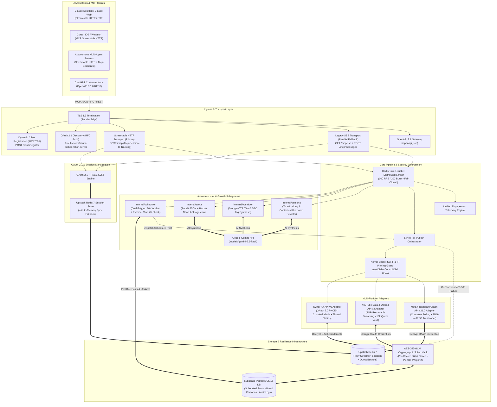

# Social Publishing MCP Server — Technical Architecture Specification

This document details the distributed systems architecture, zero-trust cryptographic model, dual-transport MCP networking, autonomous scheduling engine, AI growth subsystems, and cloud infrastructure of the **Social Publishing & Analytics MCP Server**.

---

## 1. High-Level System Architecture Blueprint

The server is built with pure **Go (1.26.6)** to achieve microsecond latency, zero runtime garbage collector spikes, and minimal memory footprint. It bridges Large Language Model (LLM) clients to social networks via the **Model Context Protocol (MCP)** specification while maintaining an isolated AES-256-GCM cryptographic vault.

---

## 2. MCP Transport & Networking Layer

The server implements **dual-transport support** conforming to Model Context Protocol standards:

### 2.1 Primary: Streamable HTTP Transport (`POST /mcp`)
- **Single Endpoint Dispatch**: Handles client requests over `POST /mcp` with streaming response capability.
- **Session Identification**: Tracks multi-turn conversational tool state using the standard `Mcp-Session-Id` HTTP header.
- **Session Storage**: Sessions are persisted in **Upstash Redis** (TTL: 24 hours) with automatic in-memory fallback for high resilience across container cold starts.

### 2.2 Parallel Legacy: Server-Sent Events (`GET /mcp/sse` + `POST /mcp/messages`)
- Maintained in parallel for full backward compatibility with older MCP client builds (e.g. legacy Claude Desktop, Cursor SSE).
- Dynamic endpoint resolution generates public HTTPS URLs (`data: https://social-mcp.duckdns.org/mcp/messages?sessionId=...`) derived from `X-Forwarded-Proto` / `X-Forwarded-Host`.

### 2.3 Dynamic Client Registration (RFC 7591) & Discovery (RFC 8414)
- **`POST /oauth/register`**: Implements RFC 7591 DCR, allowing modern MCP clients to register client credentials dynamically without manual developer portal setup.
- **`GET /.well-known/oauth-authorization-server` & `GET /.well-known/openid-configuration`**: Returns RFC 8414 discovery metadata with strict `https://` issuer scheme enforcement and advertised endpoints (`/oauth/authorize`, `/oauth/token`, `/oauth/register`).

---

## 3. Core Internal Subsystems & Packages

### 3.1 Autonomous Scheduling Engine (`internal/scheduler`)
- **Dual-Trigger Architecture**:
  1. **Internal Polling Worker**: A lightweight background Go goroutine runs every 30 seconds, querying Supabase for posts where `status = 'pending'` and `scheduled_time <= NOW()`.
  2. **External Serverless Cron Webhook (`POST /api/v1/cron/execute-scheduled`)**: Allows external cron triggers (GitHub Actions, Cloudflare Workers, EasyCron) to trigger immediate execution of due posts.
- **Idempotency & Concurrency**: Uses row-level locks (`SELECT ... FOR UPDATE SKIP LOCKED`) to ensure exactly-once execution across distributed instances.

### 3.2 Real-Time Trending Topic Scout (`internal/scout`)
- **Live Community Discussion Ingestion**:
  - Reddit: Public subreddit feeds (`/r/artificial`, `/r/technology`, `/r/programming.json`) ingested without API keys.
  - Hacker News: Official Firebase real-time top stories API (`https://hacker-news.firebaseio.com/v0/topstories.json`).
- **AI Content Synthesis**: Leverages **Google Gemini 2.5 Flash** (`models/gemini-2.5-flash`) with dynamic brand persona injection to generate platform-specific viral hooks, tailored captions, and sanitized camelCase hashtags.

### 3.3 CTR & SEO Metadata Optimizer (`internal/optimizer`)
- **Psychological Title Angle Engine**: Generates 3 distinct high-converting title variations for any post topic:
  1. *Curiosity Gap Angle*: Creates intrigue without misleading.
  2. *Data-Driven Angle*: Highlights measurable statistics and outcomes.
  3. *Contrarian Angle*: Challenges common assumptions.
- **Search Engine Discovery**: Evaluates keyword density and generates platform-tailored discoverability tags for YouTube search and Instagram explore feeds.

### 3.4 Brand Persona & Voice Lock Engine (`internal/persona`)
- **Persistent Voice Guidelines**: Stores per-tenant tone profiles, audience target rules, and visual aesthetic guidelines in Supabase.
- **Contextual Buzzword Rewriter**: Replaces forbidden corporate buzzwords (*"delve"*, *"game-changer"*, *"tapestry"*, *"synergy"*) using an LLM rewrite pipeline that reconstructs sentences naturally rather than performing destructive synonym swaps.

---

## 4. Cloud Infrastructure & Sub-Processors

| Component | Provider / Infrastructure | Role |
| :--- | :--- | :--- |
| **Container Hosting** | **Render Cloud Platform** | Managed container runtime, TLS 1.3 edge listener, automatic zero-downtime deploys. |
| **Relational Database** | **Supabase (PostgreSQL 16)** | Multi-tenant token vault, scheduled post queue, brand persona storage, audit logs. |
| **Distributed Caching & Queues** | **Upstash (Redis 7)** | Streamable HTTP sessions, distributed rate limiting, exponential backoff retry queues. |
| **AI Content Intelligence** | **Google Gemini API** (`gemini-2.5-flash`) | Real-time trending analysis, viral hook generation, CTR metadata optimization, buzzword rewriting. |

---

## 5. Public HTTP Endpoints & Discovery Catalog

| Endpoint | Method | Purpose | Auth Required |
| :--- | :--- | :--- | :--- |
| `/` | `GET` | Official Apple-styled web landing page & 1-click connect hub | Public |
| `/privacy` | `GET` | Full HTML Privacy Policy & sub-processor disclosures | Public |
| `/terms` | `GET` | Full HTML Terms of Service & AI review guidelines | Public |
| `/.well-known/oauth-authorization-server` | `GET` | RFC 8414 OAuth 2.1 Discovery Metadata | Public |
| `/.well-known/openid-configuration` | `GET` | OpenID Connect Discovery Metadata | Public |
| `/oauth/register` | `POST` | RFC 7591 Dynamic Client Registration (DCR) | Public |
| `/openapi.json` | `GET` | OpenAPI 3.1.0 specification for ChatGPT Actions | Public |
| `/health` | `GET` | System healthcheck and database/Redis status | Public |
| `/mcp` | `POST` | Primary Streamable HTTP MCP transport | Bearer / OAuth |
| `/mcp/sse` | `GET` | Legacy Server-Sent Events stream | Bearer / OAuth |
| `/mcp/messages` | `POST` | Legacy SSE JSON-RPC message receiver | Bearer / OAuth |
| `/api/v1/cron/execute-scheduled` | `POST` | External serverless cron trigger for scheduler | Bearer / Secret |
