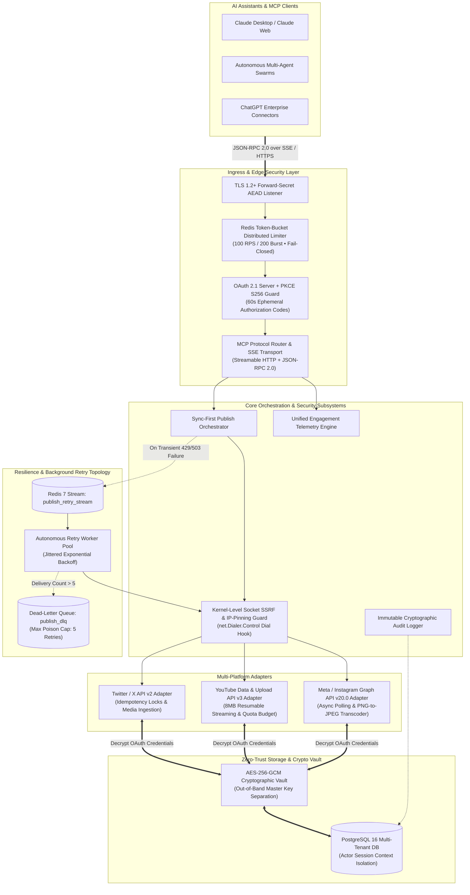
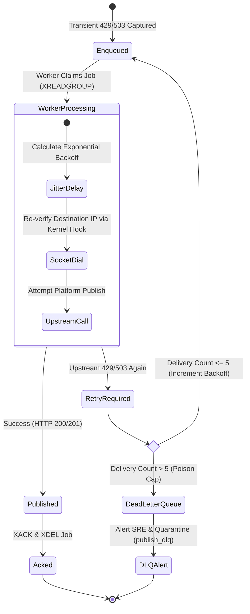
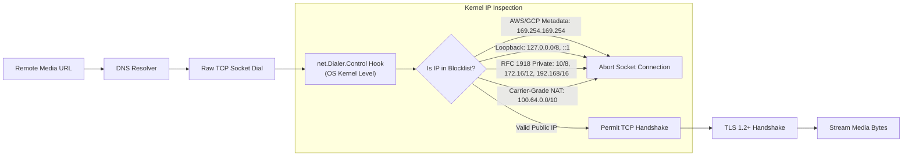

# Social Publishing MCP Server — Enterprise Technical Architecture

This specification details the distributed systems design, zero-trust security model, real-time request lifecycle, resilient asynchronous retry topology, and platform integration adapters of the **Social Publishing MCP Server**.

---

## 1. Executive Technical Architecture

The Social Publishing MCP Server is engineered for high-concurrency, multi-tenant enterprise workloads. It bridges AI assistants (Claude, ChatGPT, Gemini, custom autonomous agents) to external social networks through the **Model Context Protocol (MCP)** standard while enforcing strict cryptographic isolation, zero secret leakage, and kernel-level network guards.



---

## 2. End-to-End Request Lifecycle & Publish Pipeline

The system enforces a **Sync-First Resilient Dispatch** pattern:
1. **Immediate Execution**: First publish attempts run synchronously against the social platform API for zero-latency response.
2. **Transient Interception**: If an upstream platform throttles or experiences temporary downtime (HTTP 429 / 503), the payload is AES-encrypted and enqueued into a Redis 7 Stream.
3. **Background Recovery**: Background workers retry execution with jittered exponential backoff without dropping the user's publication.

```mermaid
sequenceDiagram
    autonumber
    actor LLM as Claude / AI Client
    participant GW as MCP Gateway & Auth Guard
    participant RL as Redis Distributed Limiter
    participant SSRF as Kernel Socket SSRF Guard
    participant Adapter as Platform Adapter
    participant Stream as Redis 7 Retry Stream
    participant SocialAPI as Upstream Social Platform

    LLM->>GW: tools/call: publish_post (platform, content, media_urls)
    GW->>RL: Check User Platform Quota & Rate Limit
    alt Rate Limit Exceeded
        RL-->>GW: HTTP 429 Throttled
        GW-->>LLM: Error: Rate limit exceeded (fail-closed protection)
    else Limit Allowed
        RL-->>GW: Token Leased
        GW->>SSRF: Validate Remote Media URLs (Preflight DNS + CIDR Check)
        alt Private Subnet / Cloud Metadata IP
            SSRF-->>GW: SSRF Violation Detected
            GW-->>LLM: Error: Remote media URL rejected (Security Policy)
        else Valid Public Media URL
            SSRF-->>GW: Media Approved
            GW->>Adapter: Dispatch Publish (with SafeHTTPTransport)
            Adapter->>SocialAPI: HTTPS TLS 1.2+ API Request
            alt Initial Attempt Succeeds (HTTP 200/201)
                SocialAPI-->>Adapter: Post Published (platform_post_id)
                Adapter-->>GW: Success
                GW-->>LLM: Result: Published successfully (post_id: 12345)
            else Transient Upstream Failure (HTTP 429 / 503 / Network Timeout)
                SocialAPI-->>Adapter: 429 Too Many Requests / 503 Service Unavailable
                Adapter->>Stream: XADD publish_retry_stream (AES-256 Payload)
                Stream-->>Adapter: Enqueued Job ID
                Adapter-->>GW: Transient failure caught; queued for retry
                GW-->>LLM: Result: Queued for automatic background retry
            end
        end
    end
```

---

## 3. Resilient Background Worker & Poison Message Quarantine

Background workers consume retry streams using Redis Consumer Groups (`XREADGROUP` / `XAUTOCLAIM`). Stalled or poison payloads that cause repeated worker failures are systematically quarantined to prevent worker death spirals:



---

## 4. Kernel-Level Socket SSRF & DNS-Rebinding Defense

Standard application-layer URL preflight checks are vulnerable to **Time-of-Check to Time-of-Use (TOCTOU) DNS Rebinding** when background queue workers retry fetches minutes after initial validation.

The Social Publishing MCP Server implements a **Kernel-Level Socket Dial Hook** (`NewSafeHTTPTransport`):



---

## 5. Zero-Trust Storage & Multi-Tenant Actor Isolation

1. **AES-256-GCM Vault**:
   - Every OAuth token is encrypted with distinct 96-bit random nonces and 128-bit authentication tags.
   - Master keys are injected strictly via environment configuration from external secret managers (HashiCorp Vault, AWS Secrets Manager, Kubernetes Sealed Secrets) and are never persisted in database snapshots.
2. **Actor Session Context Isolation**:
   - Every query automatically validates the requesting actor via `database.GetActor(ctx)`.
   - SQL queries enforce strict tenant ownership constraints (`WHERE user_id = $1`). Cross-tenant IDOR probes are instantly rejected.
3. **Immutable Audit Logging**:
   - Write actions (`publish_post`, `token_refresh`, `disconnect`) generate immutable audit log records with dual-layer secret scrubbing (`[REDACTED]`).

---

## 6. Multi-Platform Adapters

| Platform | Primary Protocols | Resilience & Optimization Features |
| :--- | :--- | :--- |
| **Twitter / X** | Twitter API v2 (`POST /2/tweets`)<br>`upload.twitter.com` | • Transactional idempotency locks preventing duplicate tweets<br>• Multi-image attachment pipeline<br>• Free & Paid tier compatibility |
| **YouTube** | Google Resumable Chunked Upload Protocol (`upload/v3`) | • $8\text{MB}$ streaming chunks with $<1.0\text{MB}$ heap allocation delta<br>• Resumes failed uploads mid-stream with zero duplicate quota loss<br>• $10{,}000\text{ units/day}$ per-tenant quota budget tracker |
| **Instagram** | Meta Graph API v20.0 (`/media` + `/media_publish`) | • Two-stage container creation & async state polling<br>• Automatic PNG-to-JPEG transcoding pipeline<br>• Multi-metric engagement analytics (`impressions`, `reach`, `likes`, `comments`, `shares`, `saved`) |
