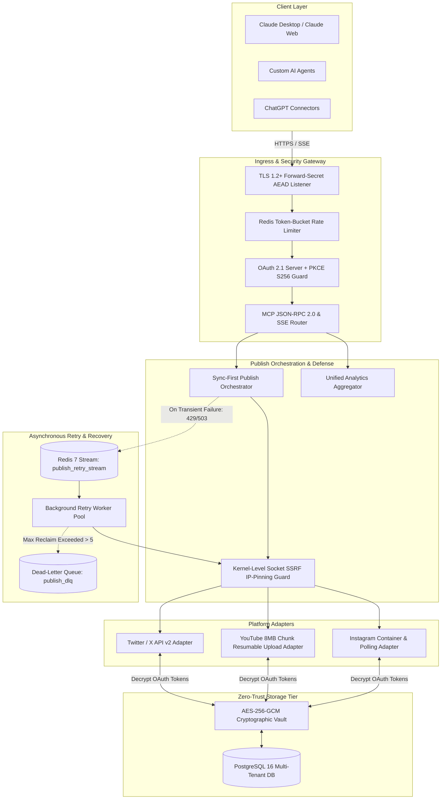

# Social Publishing MCP Server — Technical Architecture

This document provides a comprehensive technical breakdown of the architecture, security model, request lifecycle, background retry queues, and platform adapters of the **Social Publishing MCP Server**.

---

## 1. Multi-Tier System Blueprint



---

## 2. End-to-End Publish Request Lifecycle

The server enforces a **Sync-First** publishing design: when an AI assistant issues a `publish_post` MCP tool call, the server immediately attempts synchronous dispatch to the upstream platform. If a transient network or rate-limit error ($429, 503$) occurs, the post is automatically enqueued into an encrypted Redis 7 Stream for background exponential backoff retries.

```mermaid
sequenceDiagram
    autonumber
    actor LLM as Claude / AI Client
    participant Server as MCP Gateway
    participant RateLimit as Redis Rate Limiter
    participant SSRF as SSRF Kernel Guard
    participant Adapter as Platform Adapter
    participant Stream as Redis Retry Stream
    participant Platform as Social API (Twitter/YT/Meta)

    LLM->>Server: tools/call (publish_post: {platform, content, media_urls})
    Server->>RateLimit: Check Rate Limit (user_id + platform)
    alt Rate Limit Exceeded
        RateLimit-->>Server: HTTP 429 Throttled
        Server-->>LLM: Error: Rate limit exceeded (fail-closed)
    else Limit OK
        RateLimit-->>Server: Token Granted
        Server->>SSRF: Validate media_urls (Preflight DNS + CIDR Check)
        alt Private/Loopback/Metadata IP
            SSRF-->>Server: SSRF Violation
            Server-->>LLM: Error: Malicious URL rejected
        else Public URL
            SSRF-->>Server: URL Approved
            Server->>Adapter: Execute Publish (with SafeHTTPClient socket hook)
            Adapter->>Platform: HTTPS API Call
            alt Success (HTTP 200/201)
                Platform-->>Adapter: Post Created (id: 12345)
                Adapter-->>Server: Publish Success
                Server-->>LLM: Result: Published successfully (post_id: 12345)
            else Transient Error (HTTP 429 / 503)
                Platform-->>Adapter: 429 / 503 Transient Failure
                Adapter->>Stream: XADD publish_retry_stream (Payload + AES Encrypted)
                Stream-->>Adapter: Enqueued
                Adapter-->>Server: Transient failure caught; enqueued for background retry
                Server-->>LLM: Result: Initial attempt failed transiently; queued for background retry
            end
        end
    end
```

---

## 3. Core Architectural Subsystems

### 3.1 Kernel-Level Socket SSRF & DNS-Rebinding Protection
- **Vulnerability Solved**: Traditional preflight URL checkers suffer from Time-of-Check to Time-of-Use (TOCTOU) DNS rebinding attacks when background queue workers retry fetches minutes after initial validation.
- **Implementation ([internal/security/ssrf.go](internal/security/ssrf.go))**:
  - `NewSafeHTTPTransport` configures a custom `net.Dialer.Control` hook executed at the raw socket level during TCP connection establishment.
  - The exact resolved destination IP is inspected by the operating system kernel before any HTTP bytes are transmitted. If the destination resolves to AWS/GCP metadata (`169.254.169.254`), loopback (`127.0.0.0/8`, `::1`), RFC 1918 private subnets (`10.0.0.0/8`, `172.16.0.0/12`, `192.168.0.0/16`), or Carrier-Grade NAT, the socket is immediately aborted.

### 3.2 Redis 7 Stream Retry Queue & Poison Message Quarantine
- **Queue Architecture ([internal/queue/queue.go](internal/queue/queue.go))**:
  - Persistent distributed stream `publish_retry_stream` managed via Redis Consumer Groups (`retry_workers`).
  - **Exponential Backoff**: Jittered exponential delay algorithm:
    $$\text{Backoff}(attempt) = \min(2^{attempt} \times 1\text{s} + \text{jitter}, 300\text{s})$$
  - **Dead-Letter Queue (DLQ)**: Stalled worker jobs are reclaimed using `XAUTOCLAIM`. If a single poison job fails processing more than 5 times (`delivery_count > 5`), it is automatically diverted to `publish_dlq` to protect workers from infinite crash loops.

### 3.3 Zero-Trust Relational Vault & Actor Context Isolation
- **Token Vault ([internal/database/repository.go](internal/database/repository.go))**:
  - OAuth credentials are encrypted at rest using AES-256-GCM authenticated encryption with distinct 96-bit random nonces.
  - Decryption keys are managed strictly out-of-band via external secret managers and never stored with database snapshots.
  - Every database query evaluates actor session context via `database.GetActor(ctx)`. Cross-user data retrieval attempts abort immediately with `ErrUnauthorizedAccess`.

---

## 4. Platform Adapter Implementations

### 4.1 Twitter / X Adapter (`internal/adapters/twitter`)
- Targets Twitter API v2 endpoints (`POST /2/tweets`).
- Uploads images via chunked upload endpoints (`upload.twitter.com`).
- Enforces transactional idempotency locks to eliminate duplicate tweet creation during network retries.

### 4.2 YouTube Adapter (`internal/adapters/youtube`)
- Implements the Google Resumable Chunked Upload Protocol ($8\text{MB}$ streaming chunks).
- Ingests $100\text{MB}+$ video files with under $1\text{MB}$ of heap allocation delta.
- Tracks per-tenant daily quota budgets ($10{,}000\text{ units/day}$) with automated reservation refunds upon pre-upload failures.

### 4.3 Instagram Adapter (`internal/adapters/instagram`)
- Implements the Meta Graph API container lifecycle (`POST /media` container creation $\rightarrow$ async polling state machine $\rightarrow$ `POST /media_publish`).
- Automatic image preprocessing: transforms PNG images to JPEG format with proper aspect ratio headers.
- Aggregates multi-metric engagement analytics (`impressions`, `reach`, `likes`, `comments`, `shares`, `saved`).
