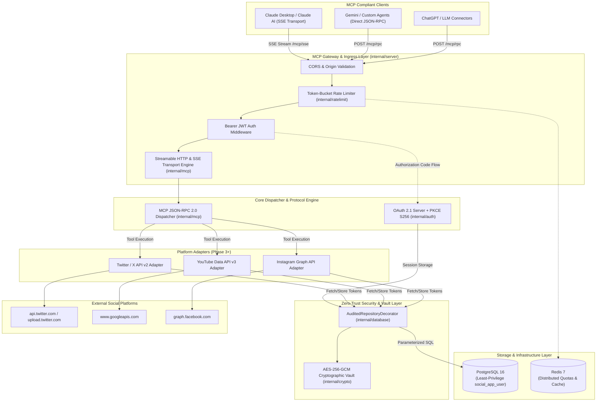
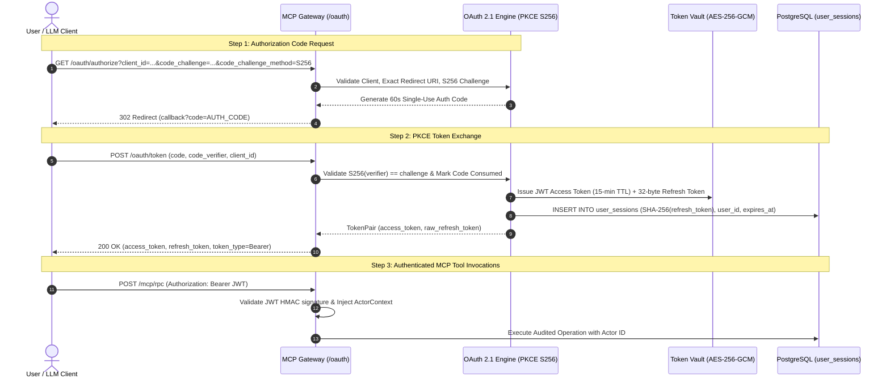
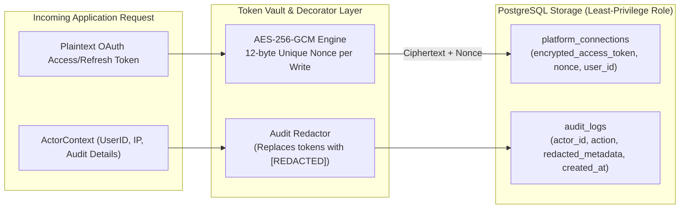
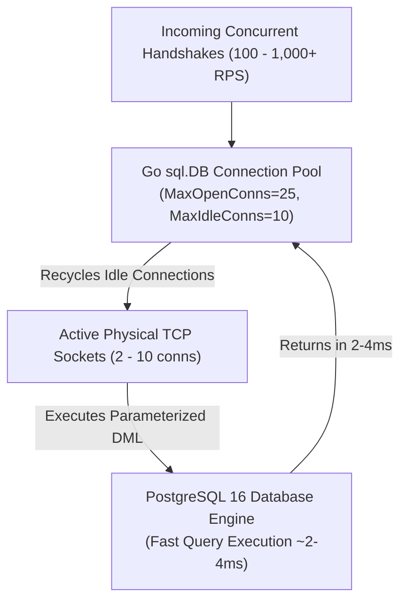

# Social Publishing & Analytics MCP Server — Architecture Specification

This document provides a detailed technical and visual breakdown of the architecture, cryptographic security model, data flows, and component interactions within the **Social Publishing & Analytics MCP Server**.

---

## 1. High-Level System Architecture

---

## 2. OAuth 2.1 Authentication & PKCE Handshake Flow

---

## 3. Multi-Tenant Cryptographic Isolation & Token Security

---

## 4. Connection Pool & Scalability Architecture

> **Connection Lifecycle Dynamics**:
> In high-throughput micro-benchmarks with sub-5ms query times, the connection pool continuously reuses warm idle sockets rather than spawning physical sockets up to `MaxOpenConns`, ensuring minimal socket churn and low kernel overhead.
