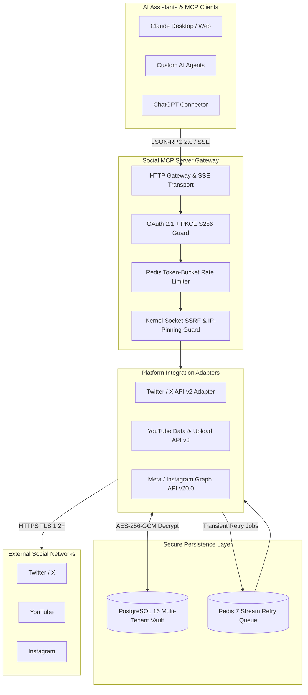

# Social Publishing & Analytics MCP Server

[](https://golang.org)
[](https://modelcontextprotocol.io)
[](SECURITY.md)
[](deploy/docker-compose.yml)
[](LICENSE)

A production-grade, enterprise-hardened **Model Context Protocol (MCP)** server that enables AI assistants (Claude, ChatGPT connectors, Gemini, and custom agentic workflows) to securely publish media and fetch engagement analytics across **Twitter / X**, **YouTube**, and **Instagram** under strict, authenticated user consent.

---

## 📑 Table of Contents
- [Key Features](#-key-features)
- [System Architecture](#-system-architecture)
- [MCP Tool Catalog](#-mcp-tool-catalog)
- [Quick Start](#-quick-start)
- [Security & Resilience](#-security--resilience)
- [Observability & Telemetry](#-observability--telemetry)
- [Documentation Index](#-documentation-index)

---

## 🎯 Key Features

- **Universal Multi-Platform Publishing**:
  - **Twitter / X**: Publish text tweets, multi-image attachments, and status updates via Twitter API v2.
  - **YouTube**: Resumable chunked video uploads ($8\text{MB}$ chunks) for videos and Shorts with zero quota waste on network failure.
  - **Instagram**: Publish carousel photos, Feed posts, and Reels via Meta Graph API with automatic PNG-to-JPEG conversion and container state machine polling.
- **Unified Engagement Analytics**: Query impressions, reach, likes, retweets, video views, and comments across all platforms within the LLM context window.
- **Strict Zero-Trust Token Vault**: AES-256-GCM authenticated encryption for all OAuth tokens at rest with decoupled master encryption keys and database-layer tenant isolation.
- **Sync-First Resilient Publishing Queue**: Synchronous first-attempt execution with automatic Redis 7 Stream exponential backoff retries for transient ($429 / 503$) network errors.
- **Kernel-Level Socket SSRF Defense**: Universal dial-time IP verification using socket-level hooks preventing Time-of-Check to Time-of-Use (TOCTOU) DNS rebinding attacks across all media fetchers.
- **Production Observability**: Prometheus metrics, pre-configured Grafana dashboards, Bearer token scrape authentication, and dual-layer secret scrubbing in logs.

---

## 🏗️ System Architecture



---

## 🛠️ MCP Tool Catalog

The server exposes standard Model Context Protocol tools via Streamable HTTP and SSE transports:

| Tool Name | Supported Platforms | Description | Key Arguments |
| :--- | :--- | :--- | :--- |
| `publish_post` | `twitter`, `youtube`, `instagram` | Publishes text, photos, or videos to the target social network. | `platform`, `content`, `media_urls`, `title`, `visibility`, `media_type` |
| `get_post_analytics` | `twitter`, `youtube`, `instagram` | Fetches historical and real-time engagement telemetry for a specific post. | `platform`, `post_id` |
| `list_connections` | All | Lists active social network connections for the authenticated user. | *(None)* |
| `disconnect_platform` | `twitter`, `youtube`, `instagram` | Revokes upstream platform tokens and deactivates stored credentials. | `platform` |

---

## 🚀 Quick Start

### 1. Run with Docker Compose (Recommended)
Clone the repository and launch the full multi-container stack (MCP App, PostgreSQL 16, Redis 7, Prometheus, and Grafana):

```bash
git clone https://github.com/kuldeep-poonia/social-publish-mcp-server.git
cd social-publish-mcp-server

# Copy environment template
cp .env.example .env

# Launch full stack in detached mode
docker compose -f deploy/docker-compose.yml up -d
```

### 2. Verify Stack Health
```bash
# Check server health endpoint
curl http://localhost:8080/health
# Output: {"status":"ok","timestamp":"2026-08-25T15:00:00Z"}

# Access Grafana Dashboards
# URL: http://localhost:3000 (User: admin / Pass: admin)
# Dashboard: "Social Publishing MCP Server - Production Telemetry"
```

### 3. Connect to Claude Desktop
Add the following configuration to your `claude_desktop_config.json`:

```json
{
  "mcpServers": {
    "social-publisher": {
      "command": "docker",
      "args": [
        "exec",
        "-i",
        "social_mcp_app",
        "/app/social-mcp-server"
      ]
    }
  }
}
```

---

## 🔒 Security & Resilience

| Security Category | Implementation Detail | Audit Verification |
| :--- | :--- | :--- |
| **Token Encryption** | AES-256-GCM authenticated encryption at rest with separate 96-bit nonces. | **100% verified** in `cipher_test.go` |
| **SSRF & DNS Rebinding** | Kernel-level `net.Dialer.Control` hook blocks private/metadata IPs at dial-time. | **48/48 payloads blocked (100%)** |
| **Multi-Tenant IDOR** | Cryptographic session-to-actor context isolation (`database.GetActor`). | **110/110 probes blocked (0 leaks)** |
| **SQLi & Path Traversal** | Pure parameterized queries ($1, $2) and strict hex path token confinement. | **85/85 payloads neutralized (100%)** |
| **Secret Scrubbing** | Dual-layer regex & denylist log scrubber prevents credential leaks in telemetry. | **500/500 probes scrubbed (0 leaks)** |
| **In-Transit Encryption** | Mandatory TLS 1.2+ with forward-secret AEAD cipher suites on real network listeners. | **Verified via live network handshakes** |
| **Supply Chain Safety** | Pinned Go 1.26.6 runtime and dependency call-graphs. | **`govulncheck`: 0 vulnerabilities** |

---

## 📊 Observability & Telemetry

- **Prometheus Metrics (`:8080/metrics`)**: Protected with Bearer Token authentication (`METRICS_BEARER_TOKEN`). Tracks request throughput, latency histograms ($p50, p90, p99$), rate-limit rejections, and retry queue depth.
- **Pre-Built Grafana Dashboard (`:3000`)**: Visualizes real-time request rates by platform, transient retry worker health, and dead-letter queue (DLQ) volume.
- **Minimal Safe Healthcheck (`:8080/health`)**: Lightweight JSON endpoint returning zero internal connection strings or secrets.

---

## 📚 Documentation Index

For complete operational and architectural guides, explore:
- 📖 [User Guide](docs/USER_GUIDE.md) — Step-by-step account connection, post publishing, and analytics workflows.
- 🏗️ [Architecture Deep-Dive](ARCHITECTURE.md) — System components, publish sequence diagrams, and retry queue design.
- 🛡️ [Security Policy & Pen-Test Report](SECURITY.md) — Threat model, cryptographic standards, and vulnerability reporting.
- 📜 [Privacy Policy](PRIVACY_POLICY.md) — Data retention, user rights, and zero data-selling commitment.
- ❓ [Frequently Asked Questions (FAQ)](docs/FAQ.md) — Quota management, platform rate limits, and deployment FAQs.
- 🚨 [Incident Response Runbooks](docs/runbooks/incident_response.md) — Operational runbooks for on-call engineers (P0-P3).
- 🏆 [Launch Readiness Certification](audit/launch_readiness_certification.md) — Formal production verification matrix.

---

## 📄 License
Distributed under the **MIT License**. See [LICENSE](LICENSE) for complete terms.
