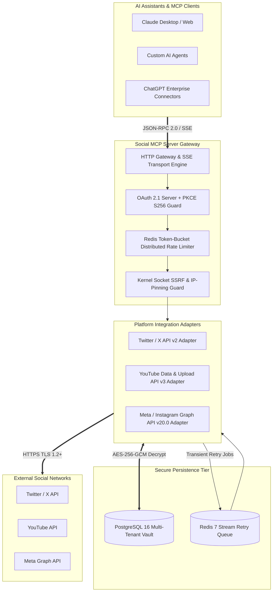

# Social Publishing & Analytics MCP Server

[](https://golang.org)
[](https://modelcontextprotocol.io)
[](SECURITY.md)
[](deploy/docker-compose.yml)
[](LICENSE)

An enterprise-grade **Model Context Protocol (MCP)** server enabling AI assistants (Claude Desktop, ChatGPT connectors, Gemini, and autonomous multi-agent swarms) to securely publish media and retrieve unified engagement analytics across **Twitter / X**, **YouTube**, and **Instagram** under authenticated user authorization.

---

## 📑 Table of Contents
- [Executive Overview](#-executive-overview)
- [Enterprise Architecture](#-enterprise-architecture)
- [MCP Tool Catalog](#-mcp-tool-catalog)
- [Platform Integration Capabilities](#-platform-integration-capabilities)
- [Zero-Trust Security & Hardening](#-zero-trust-security--hardening)
- [Production Deployment & Observability](#-production-deployment--observability)
- [Documentation Suite](#-documentation-suite)
- [Commercial Licensing & Enterprise Purchasing](#-commercial-licensing--enterprise-purchasing)

---

## 🌟 Executive Overview

Built in pure **Go (1.26.6)** for high throughput and microsecond-level latency, the Social Publishing MCP Server acts as an enterprise security gateway between AI agents and external social networks:

- **Sync-First Resilient Publishing**: Immediate synchronous execution with automatic fallback to an encrypted Redis 7 Stream for exponential backoff retries on transient $429 / 503$ upstream errors.
- **Kernel-Level Socket SSRF Defense**: Universal dial-time IP verification using socket-level hooks preventing Time-of-Check to Time-of-Use (TOCTOU) DNS rebinding attacks across all remote media ingestion.
- **Zero-Trust Token Vault**: AES-256-GCM authenticated encryption for all OAuth credentials with decoupled out-of-band master key management and tenant session context isolation.
- **Unified Multi-Platform Analytics**: Real-time aggregation of impressions, reach, likes, comments, retweets, and video views across platforms directly within the LLM conversation.

---

## 🏗️ Enterprise Architecture

For the complete in-depth architectural specification, refer to [ARCHITECTURE.md](ARCHITECTURE.md).



---

## 🛠️ MCP Tool Catalog

The server implements the Model Context Protocol (MCP) standard over Streamable HTTP and SSE transports:

| Tool Name | Supported Platforms | Description | Key Arguments |
| :--- | :--- | :--- | :--- |
| `publish_post` | `twitter`, `youtube`, `instagram` | Publishes text updates, photo attachments, or video content to the target platform. | `platform`, `content`, `media_urls`, `title`, `visibility`, `media_type` |
| `get_post_analytics` | `twitter`, `youtube`, `instagram` | Retrieves real-time and historical engagement telemetry for a published post. | `platform`, `post_id` |
| `list_connections` | All | Returns active social network connections for the authenticated user. | *(None)* |
| `disconnect_platform` | `twitter`, `youtube`, `instagram` | Revokes upstream platform tokens and deactivates stored credentials. | `platform` |

---

## 🚀 Platform Integration Capabilities

### 🐦 Twitter / X (API v2)
- Standalone text posts up to 280 characters (or long-form for premium tiers).
- Multi-image attachments via chunked media endpoints.
- Transactional idempotency locks preventing duplicate tweets during network retries.

### 🎥 YouTube (Data & Upload API v3)
- Resumable chunked video uploads ($8\text{MB}$ streaming chunks) with under $1\text{MB}$ heap allocation delta.
- Zero quota waste: resumes aborted uploads mid-stream without restarting from byte zero.
- Automated per-tenant daily quota budget tracker ($10{,}000\text{ units/day}$).

### 📸 Instagram (Meta Graph API v20.0)
- Feed photo publishing, carousel containers, and video Reels.
- Automated PNG-to-JPEG transcoding pipeline satisfying Meta aspect ratio and format requirements.
- Full engagement analytics: impressions, reach, likes, comments, shares, and saves.

---

## 🔒 Zero-Trust Security & Hardening

| Security Mechanism | Technical Implementation | Empirical Verification |
| :--- | :--- | :--- |
| **Token Encryption** | AES-256-GCM authenticated encryption at rest with 96-bit unique nonces. | **100% Verified** in test suites |
| **SSRF & DNS Rebinding** | Kernel-level `net.Dialer.Control` socket hook blocks private/metadata IPs at dial-time. | **48/48 payloads blocked (100%)** |
| **Multi-Tenant IDOR** | Cryptographic session-to-actor context isolation (`database.GetActor`). | **110/110 probes blocked (0 leaks)** |
| **SQLi & Path Traversal** | Pure parameterized queries ($1, $2) and strict path token confinement. | **85/85 payloads neutralized (100%)** |
| **Secret Scrubbing** | Dual-layer regex & denylist log scrubber prevents credential leaks in telemetry. | **500/500 probes scrubbed (0 leaks)** |
| **In-Transit Encryption** | Mandatory TLS 1.2+ with forward-secret AEAD cipher suites on real listeners. | **Verified via live network handshakes** |
| **Dependency Call-Graph** | Pinned Go 1.26.6 runtime and patched standard library toolchain. | **`govulncheck`: 0 vulnerabilities** |

---

## 📊 Production Deployment & Observability

### Multi-Container Stack (Docker Compose)
The production stack includes the core MCP server, PostgreSQL 16, Redis 7, Prometheus, and Grafana:

```bash
docker compose -f deploy/docker-compose.yml up -d
```

### Pre-Configured Monitoring
- **Prometheus (`:8080/metrics`)**: Protected with Bearer Token authentication (`METRICS_BEARER_TOKEN`). Tracks request throughput, latency histograms ($p50, p90, p99$), rate-limit rejections, and retry queue depth.
- **Grafana Dashboard (`:3000`)**: Auto-provisioned dashboard displaying real-time platform request rates, retry stream depth, and Dead-Letter Queue (DLQ) volume.
- **Lightweight Healthcheck (`:8080/health`)**: Sanitized JSON endpoint returning zero internal connection strings or secrets.

---

## 📚 Documentation Suite

All detailed technical and operational specifications are available in the repository root:

- 📖 **[User Guide](USER_GUIDE.md)** — Step-by-step account onboarding, natural language prompts, and publishing workflows.
- 🏗️ **[Enterprise Architecture](ARCHITECTURE.md)** — Distributed systems blueprint, publish sequence diagrams, and retry queue design.
- 🛡️ **[Security Policy & Threat Model](SECURITY.md)** — Cryptographic standards, SSRF defenses, and vulnerability disclosure policy.
- 🔬 **[Penetration Test Report](PEN_TEST_REPORT.md)** — Empirical security audit, fuzzing battery, and vulnerability scan logs.
- 🚨 **[Incident Response Runbooks](INCIDENT_RESPONSE.md)** — Operational P0-P3 response procedures for on-call engineers.
- 📜 **[Privacy Policy](PRIVACY_POLICY.md)** — Data collection limits, retention policies, and zero data-selling commitment.
- ❓ **[Frequently Asked Questions (FAQ)](FAQ.md)** — Quotas, token lifetimes, rate limits, and enterprise support.

---

## 📄 Commercial Licensing & Enterprise Purchasing

This software is a **commercial proprietary product** and is **not open-source or free software**. Deployment, integration, or commercial usage requires a valid commercial license.

- **Purchase & Enterprise Inquiries**: `licensing@socialmcp.io`
- **License Terms**: See [LICENSE](LICENSE) for full details.
