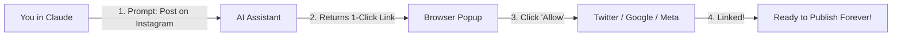

# Social Publishing MCP Server — User Guide

Welcome to the **Social Publishing MCP Server**! This guide explains how you (or any user) can connect your social media accounts and publish content or fetch analytics directly from your AI assistant (like Claude Desktop, Cursor IDE, or ChatGPT) — **without ever needing to write code or visit complex developer portals**.

---

## 📑 Contents
1. [The 2-Minute Quickstart (Zero-Code)](#1-the-2-minute-quickstart-zero-code)
2. [Connecting Your Social Accounts (1-Time OAuth)](#2-connecting-your-social-accounts-1-time-oauth)
3. [Publishing Content via Natural Language](#3-publishing-content-via-natural-language)
   - [A. Instagram (Photos, Carousels & Reels)](#a-publishing-to-instagram)
   - [B. Twitter / X (Tweets & Threads)](#b-publishing-to-twitter--x)
   - [C. YouTube (Videos & Shorts)](#c-publishing-to-youtube)
4. [Checking Real-Time Analytics](#4-checking-real-time-analytics)
5. [Managing & Disconnecting Accounts](#5-managing--disconnecting-accounts)
6. [Troubleshooting & Quotas](#6-troubleshooting--quotas)

---

## 1. The 2-Minute Quickstart (Zero-Code)

You do **not** need to open terminals, run commands, or generate manual API URLs.

### Step 1: Add the Server to Your AI Assistant

#### For Claude Desktop (`claude_desktop_config.json`):
```json
{
  "mcpServers": {
    "social-publisher": {
      "url": "https://social-mcp.duckdns.org/mcp/sse"
    }
  }
}
```

#### For Cursor IDE:
- Open Cursor $\rightarrow$ `Settings` $\rightarrow$ `Features` $\rightarrow$ `MCP Servers` $\rightarrow$ `Add New MCP Server`:
  - **Type**: `SSE`
  - **Name**: `social-publisher`
  - **URL**: `https://social-mcp.duckdns.org/mcp/sse`

---

## 2. Connecting Your Social Accounts (1-Time OAuth)

You only need to connect each social account **once**. Your login credentials are encrypted with AES-256-GCM and stored in a secure relational vault.



### Direct Connect Links:
- 📸 **Instagram**: [https://social-mcp.duckdns.org/auth/instagram/connect?user_id=YOUR_USERNAME](https://social-mcp.duckdns.org/auth/instagram/connect?user_id=YOUR_USERNAME)
- 🐦 **Twitter / X**: [https://social-mcp.duckdns.org/auth/twitter/connect?user_id=YOUR_USERNAME](https://social-mcp.duckdns.org/auth/twitter/connect?user_id=YOUR_USERNAME)
- 🎥 **YouTube**: [https://social-mcp.duckdns.org/auth/youtube/connect?user_id=YOUR_USERNAME](https://social-mcp.duckdns.org/auth/youtube/connect?user_id=YOUR_USERNAME)

> [!NOTE]
> If you prompt Claude before connecting, Claude will automatically provide your personalized 1-click authorization link right inside the chat window!

---

## 3. Publishing Content via Natural Language

Once your accounts are linked, you simply speak to your AI in plain English or Hindi.

### A. Publishing to Instagram

> **Example Prompt:**
> *"Post this photo to my Instagram with the caption 'Excited to announce our new AI product release! 🚀 #AI #Tech #Innovation': https://images.unsplash.com/photo-1618005182384-a83a8bd57fbe"*

**Supported Media Types:**
- **Feed Photos**: Single JPEG/PNG images (automatic PNG $\rightarrow$ JPEG conversion included).
- **Carousels**: Multi-image gallery posts (up to 10 photos).
- **Reels**: 9:16 vertical MP4 video clips.

---

### B. Publishing to Twitter / X

> **Example Prompt:**
> *"Write a 3-part thread about why Model Context Protocol (MCP) is the future of AI agents, and post it to my Twitter account."*

**Supported Features:**
- Single tweets (up to 280 characters).
- Multi-tweet automated reply chains (threads).
- Attached images, GIFs, and media links.

---

### C. Publishing to YouTube

> **Example Prompt:**
> *"Upload this tutorial video to my YouTube channel with the title 'Getting Started with AI Social Publishing' and set visibility to public: https://my-storage.com/tutorial.mp4"*

**Supported Features:**
- Long-form YouTube videos (8MB chunked resumable streaming).
- Vertical YouTube Shorts (tagged with `#Shorts`).
- Custom titles, descriptions, tags, and category IDs.

---

## 4. Checking Real-Time Analytics

Ask your AI assistant to check engagement stats across your social platforms without opening any dashboards:

> **Example Prompt:**
> *"Fetch the analytics and impression metrics for my latest Instagram post and Twitter announcement."*

**Returned Metrics:**
- **Instagram**: Total Impressions, Reach, Likes, Comments, Shares, Saves.
- **Twitter / X**: Impressions, Retweets, Likes, Replies, Quote Tweets.
- **YouTube**: Total Views, Like Count, Comment Count, Watch Duration.

---

## 5. Managing & Disconnecting Accounts

You have full control over your stored credentials:

### List Active Accounts
> **Prompt:** *"What social accounts do I currently have connected?"*

### Disconnect an Account
> **Prompt:** *"Disconnect my Instagram account."*
*(The server immediately revokes upstream Meta tokens and scrubs your credentials from the vault).*

---

## 6. Troubleshooting & Quotas

- **Instagram Token Expiration**: Meta issues 60-day Long-Lived Tokens. The server silently refreshes tokens on each interaction. If 60 days elapse without activity, Claude will prompt you to renew your 1-click connection.
- **YouTube Quotas**: YouTube allocates 10,000 quota units/day per project (video uploads consume 1,600 units). Quotas reset automatically at 00:00 UTC.
- **Transient Failures (429 / 503)**: If Twitter or Meta is temporarily down, the server automatically buffers your post in an encrypted Redis 7 queue and retries with jittered exponential backoff.
