# Social Publishing MCP Server — User Guide

Welcome to the **Social Publishing MCP Server**! This guide walks you through connecting your social media accounts, creating posts, uploading videos, and checking engagement analytics directly from your AI assistant (like Claude Desktop or custom AI agents).

---

## 📑 Contents
1. [Prerequisites](#1-prerequisites)
2. [Connecting Your Accounts](#2-connecting-your-accounts)
3. [Publishing Content via AI](#3-publishing-content-via-ai)
4. [Checking Engagement Analytics](#4-checking-engagement-analytics)
5. [Managing & Disconnecting Accounts](#5-managing--disconnecting-accounts)
6. [Troubleshooting & Common Questions](#6-troubleshooting--common-questions)

---

## 1. Prerequisites

Before you begin, ensure:
- The Social MCP Server is running (e.g. via Docker Compose: `docker compose up -d`).
- Your AI assistant (e.g., Claude Desktop) is configured with the MCP server entry in `claude_desktop_config.json`.

---

## 2. Connecting Your Accounts

To allow your AI assistant to publish on your behalf, connect your social accounts via secure OAuth 2.1 authorization:

```mermaid
flowchart LR
    User[You] -->|1. Request Auth Link| Claude[AI Assistant]
    Claude -->|2. Returns Link| Browser[Web Browser]
    Browser -->|3. Approve Permissions| Platform[Twitter / Google / Meta]
    Platform -->|4. Secure Code Exchange| Server[Social MCP Server]
    Server -->|5. Encrypted Vault Storage| Ready[Ready to Publish!]
```

### Step-by-Step Connection:
1. In your AI conversation, ask:  
   > *"What social media accounts do I have connected?"*
2. If an account is not connected, navigate to the authorization link in your web browser:
   - **Twitter / X**: `http://localhost:8080/auth/twitter/connect`
   - **YouTube / Google**: `http://localhost:8080/auth/youtube/connect`
   - **Instagram (Business / Creator)**: `http://localhost:8080/auth/instagram/connect`
3. Log in to the platform and grant the requested publishing permissions.
4. Upon approval, you will be redirected to a confirmation page. Your credentials are encrypted with enterprise-grade **AES-256-GCM** encryption.

---

## 3. Publishing Content via AI

Once connected, simply talk to your AI assistant using natural language.

### A. Publishing to Twitter / X
You can publish standalone text tweets or tweets with image attachments:

> **Example Prompt:**
> *"Publish a tweet saying: 'Excited to announce our new open-source MCP server release! 🚀 Check it out on GitHub.' and attach this image: https://example.com/assets/banner.jpg"*

**What happens under the hood:**
- The server validates the image URL for safety.
- It attaches the media and dispatches the tweet via Twitter API v2.
- Returns your live Tweet ID and confirmation link.

---

### B. Publishing to YouTube (Videos & Shorts)
You can upload video files and YouTube Shorts with custom titles, descriptions, and privacy settings:

> **Example Prompt:**
> *"Upload this video to YouTube with the title 'Building Autonomous Go Microservices' and set visibility to public: https://storage.googleapis.com/my-bucket/tutorial_video.mp4"*

**Key Capabilities:**
- **Resumable Streaming**: Large video uploads ($100\text{MB}+$) are streamed in resilient $8\text{MB}$ chunks. If your internet connection drops, the upload automatically resumes without wasting daily quota.
- **Privacy Settings**: Choose between `public`, `unlisted`, or `private`.

---

### C. Publishing to Instagram (Feed Photos & Reels)
You can publish photos, carousels, or video Reels to your Instagram Professional account:

> **Example Prompt:**
> *"Post this photo to my Instagram Feed with the caption 'Behind the scenes at our engineering summit! 📸✨ #Tech #Engineering': https://images.unsplash.com/photo-1579783900882-c0d3dad7b119"*

**Automatic Image Formatting:**
- If you supply a `.png` or high-resolution image, the server automatically optimizes and converts the image to Instagram-compatible JPEG format before publishing.

---

## 4. Checking Engagement Analytics

Inspect how your content is performing across all platforms without leaving your AI conversation:

> **Example Prompt:**
> *"Show me the engagement analytics and impressions for my latest Instagram post ID 1789543210."*

**Returned Metrics:**
- **Twitter**: Impressions, Retweets, Likes, Replies, Quote Tweets.
- **YouTube**: Total Views, Like Count, Comment Count, Watch Duration.
- **Instagram**: Total Impressions, Reach, Likes, Comments, Shares, Saved count.

---

## 5. Managing & Disconnecting Accounts

You remain in complete control of your connected credentials at all times:

### List Active Connections
> **Prompt:** *"List all my connected social media accounts."*

### Disconnect an Account
> **Prompt:** *"Disconnect my Twitter account."*

When you disconnect an account, the server immediately revokes the platform's upstream token and marks stored credentials as inactive.

---

## 6. Troubleshooting & Common Questions

> [!NOTE]
> **What happens if a social network is temporarily down?**  
> If Twitter, YouTube, or Instagram returns a temporary server error (HTTP 503) or rate limit (HTTP 429), the server automatically queues your post into a resilient Redis Stream and retries with exponential backoff.

> [!IMPORTANT]
> **Instagram 60-Day Token Expiration**:  
> Meta's long-lived access tokens expire after 60 days. If you haven't published in 60 days, your AI assistant will let you know that re-authentication is required. Simply visit `http://localhost:8080/auth/instagram/connect` to renew your token.

> [!TIP]
> **YouTube Daily Quota**:  
> YouTube grants 10,000 quota units per project per day (a video upload consumes 1,600 units). Quotas automatically reset daily at 00:00 UTC.
